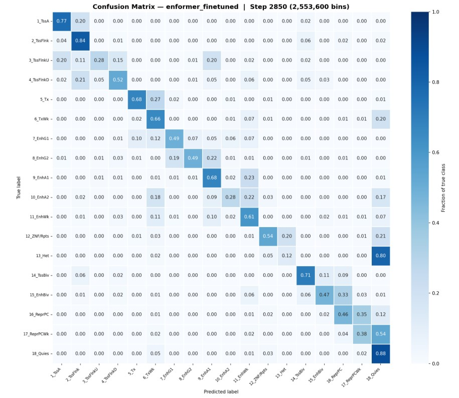
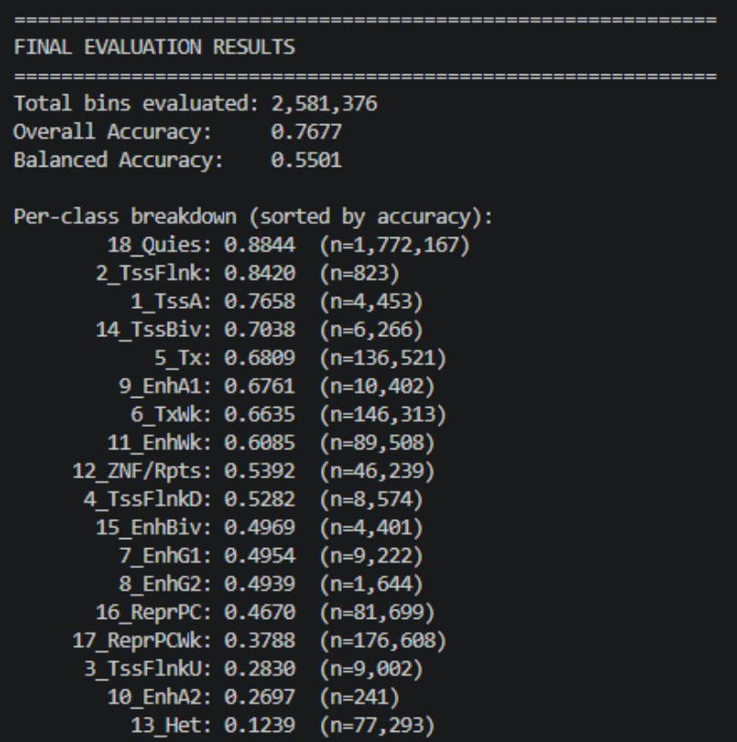

Used chromosome 8 and 9 as validation.

Also probably used "IHECRE00000994.7_18_ChromHMM.bed.gz".

<figure>
    
    <figcaption>confusion matrix</figcaption>
</figure>

<figure>
    
    <figcaption>results</figcaption>
</figure>
