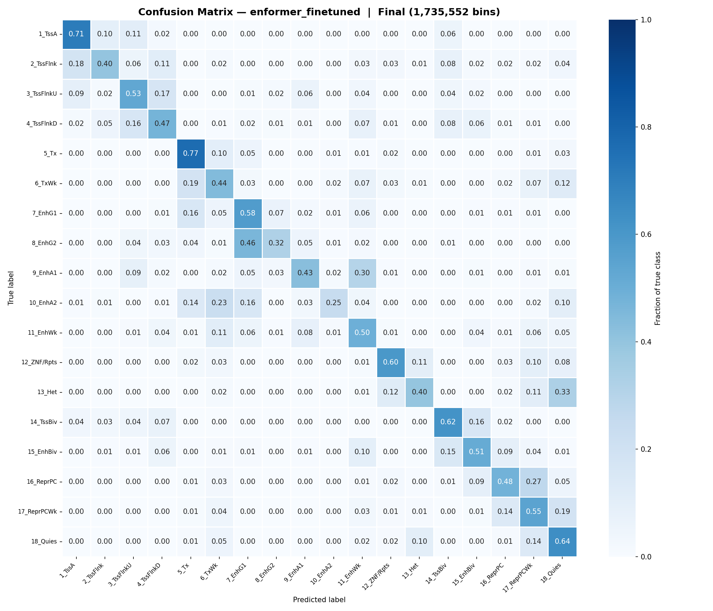

Converted data_human_sequences.bed to 196608 bp intervals, dropping windows with coordinates outside the chromosome Split into train, valid, and test sharded parquets:

(Run extend bed intervals, then run:)

```
from templates.data import get_bed_files, generate_shards_from_index
from pathlib import Path

bed_file = "IHECRE00000994.7_18_ChromHMM.bed.gz"

get_bed_files(file_names=[bed_file])

generate_shards_from_index()
```


Finetuned with 2 epochs:

```
accelerate launch \
    --multi_gpu \
    --num_processes 4 \
    --gpu_ids 0,1,2,3 \
    --mixed_precision bf16 \
    playground/finetune_enformer.py \
    --data_dir ../sample/binned_dataframe_enformer/train_shards \
    --val_data_dir ../sample/binned_dataframe_enformer/valid_shards \
    --batch_size 2 \
    --epochs 2 \
    --lr 5e-5 \
    --output_dir enformer_finetuned.pt
```

Validated with test windows:
```
python playground/evaluate_enformer.py \
    --model_path playground/enformer_finetuned.pt \
    --data_dir ../sample/binned_dataframe_enformer/test_shards \
    --batch_size 1
```


Results:
```
============================================================
FINAL EVALUATION RESULTS
============================================================
Total bins evaluated: 1,735,552
Overall Accuracy:     0.6014
Balanced Accuracy:    0.5107

Per-class breakdown (sorted by accuracy):
            5_Tx: 0.7660  (n=120,706)
          1_TssA: 0.7078  (n=5,141)
        18_Quies: 0.6391  (n=1,033,234)
       14_TssBiv: 0.6188  (n=5,625)
     12_ZNF/Rpts: 0.6011  (n=90,690)
         7_EnhG1: 0.5806  (n=7,664)
     17_ReprPCWk: 0.5504  (n=117,496)
      3_TssFlnkU: 0.5284  (n=9,258)
       15_EnhBiv: 0.5130  (n=4,125)
        11_EnhWk: 0.4959  (n=65,894)
       16_ReprPC: 0.4831  (n=58,845)
      4_TssFlnkD: 0.4748  (n=8,541)
          6_TxWk: 0.4421  (n=116,800)
         9_EnhA1: 0.4295  (n=8,923)
       2_TssFlnk: 0.3994  (n=979)
          13_Het: 0.3961  (n=79,779)
         8_EnhG2: 0.3215  (n=1,583)
        10_EnhA2: 0.2454  (n=269)
```

<figure>
    
    <figcaption>Confusion matrix for the finetuned Enformer model on the test set.</figcaption>
</figure>
    

